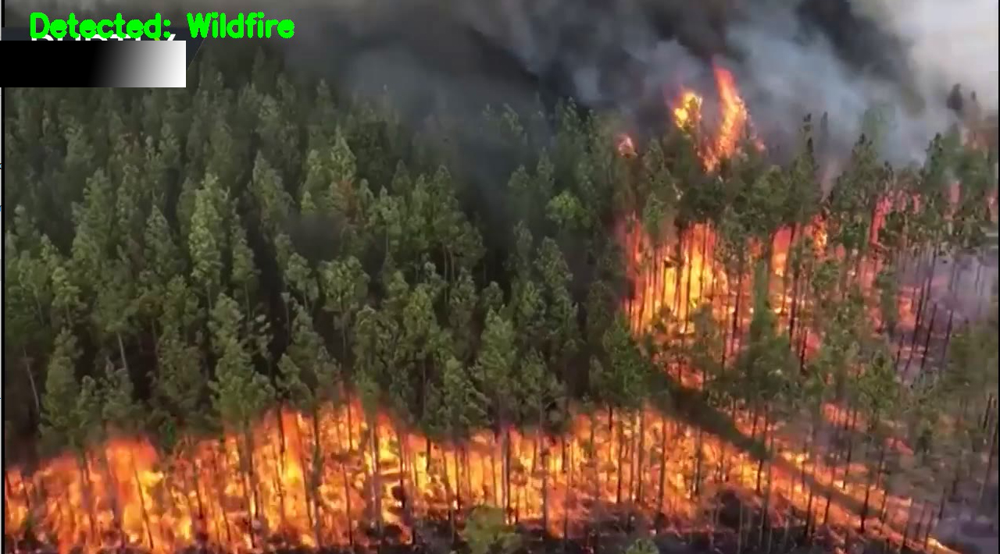

# Natural Disaster Detection
Such an application could be:

Deployed along riverbeds and streams to monitor water levels and detect floods early.
Utilized by park rangers to monitor for wildfires.
Employed by meteorologists to automatically detect hurricanes/cyclones.
Used by television news companies to sort their archives of video footage.

